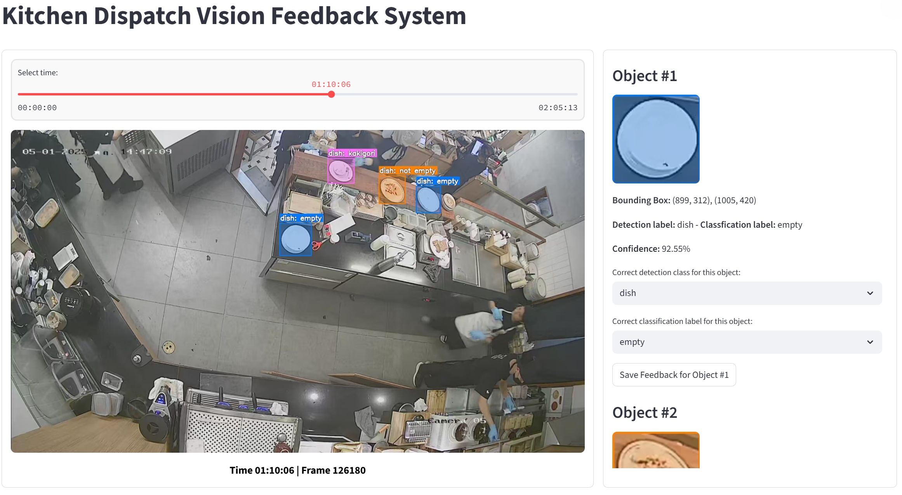

# Installation Guide and Usage Instructions
## 1. Install.
```bash
pip install -r requirements.txt
```
## 2. Training.
### The training configuration is located in the tray_dish_detection_classification.ipynb file. With two steps:
1. Train an object detection model to identify trays and dishes.
2. Train a classification model to categorize the detected objects into three classes: "not_empty", "empty", and "kakigori".
After training, three models are generated: best.pth (detection model), cls_dish_best.pth, and cls_tray_best.pth (classification models).

## 3. Evaluation on the validation dataset.
### 3.1. The valid detection result.

### 3.2. The classification results.
1. Tray object: 96.68 (Best Val Acc)
2. Dish object: 96.46 (Best Val Acc)

## 4. Inference.
### 4.1. Load streamlit tool.
The project is developed using the Streamlit tool. To execute the project:
```bash
docker pull xuanhiepp/kitchen-inspection-full:latest
docker run -p 8501:8501 xuanhiepp/kitchen-inspection-full:latest
```
Since the port is mapped as 8501:8501 in docker-compose.yml, you can open your browser and access the application at:
http://localhost:8501 or http://127.0.0.1:8501
### 4.2. Get the project output.
### The project interface has several main features:
1. The left column displays the prediction results in image format, with bounding boxes and corresponding object labels.
2. The right column presents detailed information, including bounding box coordinates, detection labels, and classification labels.
3. Additionally, this section includes a user feedback feature. Users can provide corrections for both detection and classification labels, and the feedback will be saved in a CSV file to support model performance improvement.
4. The feedback file will be named feedback.csv and stored in the feedback_data directory. This file will record essential information such as: detection timestamp, specific frame index, object coordinates, predicted labels, user feedback labels for both detection and classification tasks, and the prediction confidence score.
### To access the file directly inside the container
Step 1 — Get the running container ID:
```bash
docker ps
```
For example, you may see:
```bash
CONTAINER ID   456yhf123mnk   kitchen-inspection-full:latest
```
Step 2 — Enter the container:
```bash
docker exec -it 456yhf123mnk /bin/bash
```
Step 3 — Navigate to the feedback directory and check the file:
```bash
cd /app/feedback_data/
ls
cat feedback.csv
```
#### The picture below shows an example of a project result.


#### The picture below shows an example of a feedback result.

